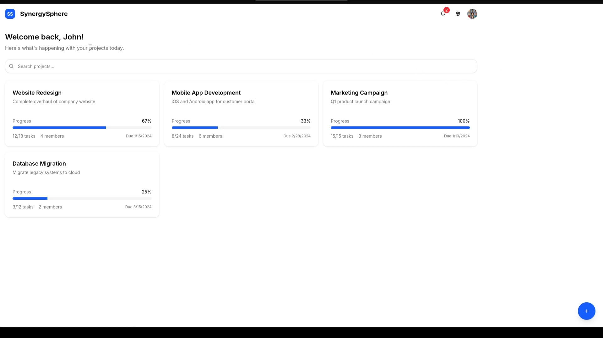
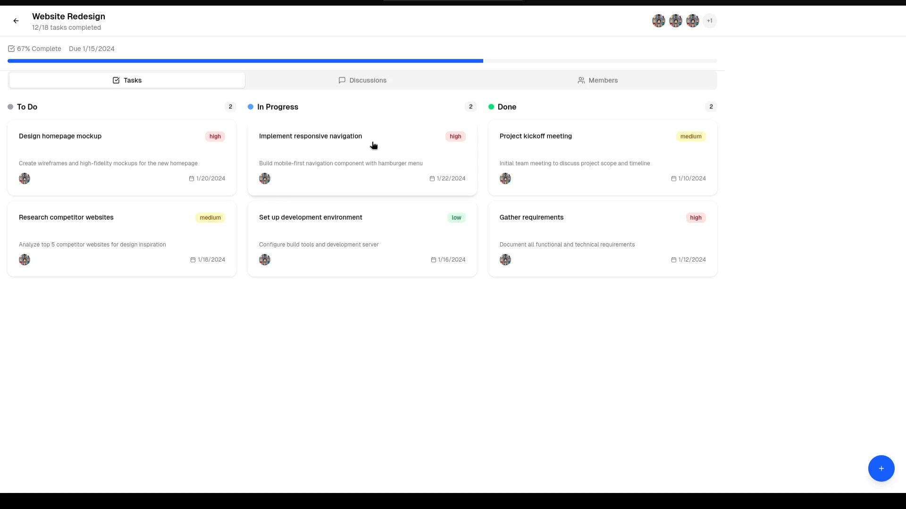

## SynergySphere – Team Collaboration Platform (MVP)

SynergySphere is a modern, mobile-first, responsive team collaboration platform. It helps teams stay organized, communicate effectively, manage tasks and projects, and receive notifications — all in a single intelligent platform.

## Features

- User authentication (signup/login/logout)

- Project creation & management

- Task assignment with due dates and statuses (To-Do / In Progress / Done)

- Project-specific threaded discussions

- Notifications for important updates

- Mobile  responsive design

## Demo Video

## Screenshots

## Steps to get this running in your machine
---

1) Clone the repo

`git clone https://github.com/your-username/synergysphere.git`
`cd synergysphere`

---

2) Install dependencies (both projects) — single command

This installs frontend and backend deps in one go:

`( cd frontend && npm install ) && ( cd backend && npm install )`

> If you use pnpm or yarn, replace npm install with pnpm install or yarn. and run those commands seperately if you are using windows 

---

3) Environment files

Copy the example env files and edit values as needed.

Frontend (frontend/.env.example)

# Frontend environment (Next.js)
NEXT_PUBLIC_API_URL=http://localhost:5000
NEXT_PUBLIC_ENV=development

Create the real file:

cp frontend/.env.example frontend/.env
# then edit frontend/.env if needed

Backend (backend/.env.example)

# Backend environment
PORT=5000
DATABASE_URL=mongodb://localhost:27017/synergysphere
JWT_SECRET=replace_this_with_a_strong_secret
NODE_ENV=development

Create the real file:

cp backend/.env.example backend/.env
# then edit backend/.env with real DB URI and JWT secret

---

4) Run locally (separately)

Open two terminals (one for backend, one for frontend).

Start backend

`cd backend`
`npm run dev`

Start frontend

`cd frontend`
`npm run dev`
# then open http://localhost:3000

Default ports

Frontend (Next.js): http://localhost:3000

Backend (API): http://localhost:5001

Make sure the frontend NEXT_PUBLIC_API_URL points to your backend URL.

---

5) Run both at once (one-liner from project root)

`npx concurrently "cd backend && npm run dev" "cd frontend && npm run dev"`

---

6) Optional: seed demo data

If the backend contains a seed script:

`cd backend`
`npm run seed`

(This will create 1 demo user, 1 project, a couple of tasks, and a sample discussion.)

---

7) Notes & troubleshooting

CORS: Ensure backend allows requests from http://localhost:3000.

DB: If using MongoDB locally, ensure Mongo server is running or use a cloud Mongo URI in DATABASE_URL.

JWT_SECRET: Use a secure random string for JWT_SECRET.

#### Built by Team Twostepoverified
